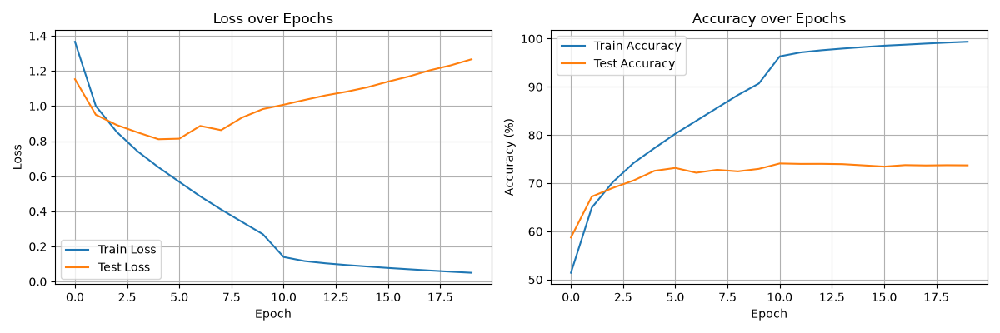
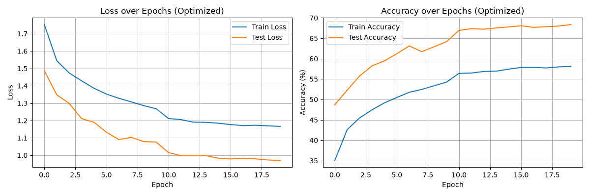

# CIFAR-10 CNN

A small convolutional network trained from scratch on [CIFAR-10](https://www.cs.toronto.edu/~kriz/cifar.html) (60,000 32×32 colour images, 10 classes), in two versions: a plain baseline and a regularised one.

## Files

| File | What it does |
|---|---|
| `cifar10.py` | Baseline CNN: 2 conv blocks + 2 fully connected layers, no augmentation or regularisation |
| `cifar10_optimized.py` | Same architecture plus data augmentation, BatchNorm, Dropout and L2 weight decay |
| `cifar10_training_curves.png` | Loss/accuracy curves from the baseline run |
| `cifar10_training_curves_optimized.png` | Loss/accuracy curves from the optimised run |
| `data/` | CIFAR-10 is downloaded here automatically on first run (not committed) |
| `models/` | Trained weights are saved here (not committed) |

## Model

```
input (3, 32, 32)
  → Conv 3→32, 3×3  → ReLU → MaxPool 2×2   → (32, 16, 16)
  → Conv 32→64, 3×3 → ReLU → MaxPool 2×2   → (64, 8, 8)
  → Flatten (4096) → Linear 4096→128 → ReLU → Linear 128→10
```

About 545k parameters. The optimised version adds `BatchNorm2d` after each conv, `Dropout(0.25)` after each conv block, and `Dropout(0.2)` between the linear layers.

| | Baseline | Optimised |
|---|---|---|
| Augmentation | none | random crop (pad 4), horizontal flip, ±15° rotation, colour jitter |
| Normalisation | – | BatchNorm after each conv |
| Dropout | – | 0.25 / 0.25 / 0.2 |
| Weight decay | – | 5e-5 (Adam) |
| Optimiser | Adam, lr 1e-3, StepLR ×0.1 every 10 epochs | same |
| Epochs / batch size | 20 / 128 | 20 / 128 |

## Running

Needs [uv](https://docs.astral.sh/uv/). The project pulls a CUDA 12.4 build of PyTorch and uses the GPU if one is available.

```bash
cd CIFAR
uv sync
uv run python cifar10.py             # baseline
uv run python cifar10_optimized.py   # regularised version
```

Each script downloads CIFAR-10 into `data/` (~170 MB), trains for 20 epochs, saves weights to `models/` and writes its training-curve PNG.

## Results

Approximate values read from the saved training curves:

| | Final train acc | Final test acc | Notes |
|---|---|---|---|
| Baseline | ~99% | ~74% | Heavy overfitting: test loss bottoms out around epoch 5 and then climbs |
| Optimised | ~58% | ~68% | No overfitting, but underfits: test accuracy is lower than the baseline |




**Reading the optimised run:** train accuracy is *below* test accuracy because training is measured on augmented images with dropout active, while testing uses clean images with dropout off. The combined regularisation is too strong for a network this small. Easing off (lighter augmentation, lower dropout) or adding a third conv block should recover accuracy while keeping the train–test gap small.
