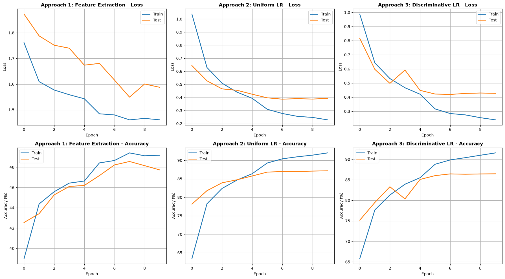
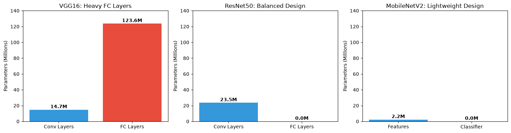

# ResNet50 Transfer Learning & Modern CNN Architectures

Two experiments on [CIFAR-10](https://www.cs.toronto.edu/~kriz/cifar.html) using ImageNet-pretrained models from `torchvision`:

1. **Transfer learning:** fine-tune ResNet50 three different ways and compare them.
2. **Architecture analysis:** compare VGG16, ResNet50 and MobileNetV2 on parameter count, where the parameters live, and inference speed.

## Files

| File | What it does |
|---|---|
| `main.py` | Trains ResNet50 on CIFAR-10 with three transfer-learning strategies and plots them side by side |
| `modernArchitecturesAnalysis.py` | Loads VGG16, ResNet50 and MobileNetV2; prints design notes, parameter breakdowns and inference timings |
| `resnet_comparison_all_approaches.png` | Loss/accuracy curves for the three strategies (from `main.py`) |
| `resnet50_training_curves.png` | Curves from an earlier single-strategy fine-tuning run |
| `architecture_comparison_params.png` | Parameter distribution per architecture (from `modernArchitecturesAnalysis.py`) |
| `data/` | CIFAR-10 is downloaded here automatically (not committed) |
| `models/` | Reserved for saved weights (not committed) |

## Running

Needs [uv](https://docs.astral.sh/uv/) and Python 3.11+. The project pulls a CUDA 13.0 build of PyTorch. A GPU is strongly recommended: `main.py` trains ResNet50 three times.

```bash
cd Resnet
uv sync
uv run python main.py                            # transfer-learning comparison
uv run python modernArchitecturesAnalysis.py     # architecture analysis (no training)
```

Pretrained ImageNet weights are downloaded by `torchvision` on first use.

## Experiment 1: transfer-learning strategies (`main.py`)

All three start from ImageNet-pretrained ResNet50, with the final layer replaced by `Linear(2048 → 10)`. Each trains for 10 epochs, batch size 128, Adam, StepLR ×0.1 every 5 epochs, with random crop + horizontal flip augmentation.

| Strategy | What trains | Learning rate(s) | Final test acc* |
|---|---|---|---|
| 1. Feature extraction | final `fc` layer only | 1e-3 | ~48% |
| 2. Fine-tuning, uniform LR | all layers | 1e-4 everywhere | ~87% |
| 3. Fine-tuning, discriminative LRs | all layers | layer1 1e-5 → layer2 5e-5 → layer3 1e-4 → layer4 5e-4 → fc 1e-3 | ~86.5% |

\*Approximate, read from the plot.



**Takeaways**
- **Feature extraction struggles here.** CIFAR-10 images are 32×32, while ResNet50's frozen features were learned on 224×224 ImageNet images. Without resizing the inputs, the frozen features don't transfer well.
- **Fine-tuning everything works far better.** Letting the backbone adapt is worth almost 40 accuracy points.
- **Uniform and discriminative LRs end up roughly tied** on this dataset after 10 epochs. Both overfit slightly: train accuracy is about 92% against about 87% on test.

## Experiment 2: architecture analysis (`modernArchitecturesAnalysis.py`)

| Model | Total params | Where the parameters are |
|---|---|---|
| VGG16 | ~138M | ~124M (≈90%) in the fully connected classifier, ~15M in conv layers |
| ResNet50 | ~25.6M | ~23.5M in conv/residual layers, tiny FC head |
| MobileNetV2 | ~3.5M | ~2.2M in feature layers, tiny classifier |



The script also works through why each design is efficient:
- **ResNet bottleneck** (256→64→256): about 8× fewer parameters than a plain 3×3 conv from 256 to 256 channels.
- **MobileNet depthwise-separable conv** (32→64): about 8× fewer parameters than a standard 3×3 conv.

It then times inference on 10 batches of CIFAR-10 test images.

**Caveats**
- The "FLOPs" column is a rough `2 × parameters` heuristic, not a measured FLOP count.
- Timings are on 32×32 CIFAR inputs, not the 224×224 inputs these models were designed for.
- `vgg16.fc = ...` doesn't actually replace VGG16's head, because VGG uses `classifier[6]`. VGG keeps its 1000-class output, which barely affects the timing.
- `pretrained=True` is deprecated in recent `torchvision`; the current form is `weights=...`.
